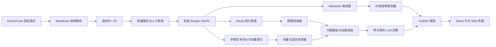

# CookKG 项目定义、故事与总体架构

## 1. 一句话定义

CookKG 是一个面向家庭做饭场景的可解释菜单规划系统：用户告诉系统家里已有的食材、
常备调料、忌口和想做的菜数，系统利用食材知识图谱选择一组满足约束的菜，合并计算补购
清单，并用可追溯的菜谱原文解释推荐与做法。

项目的课程研究问题是：

> 与逐道菜搜索或普通文本 RAG 相比，显式食材关系和组合约束能否减少菜单推荐中的约束
> 违反与重复采购，同时保持答案可追溯？

## 2. 项目故事

### 2.1 用户与情境

核心用户是需要在有限时间内决定一餐吃什么的学生或年轻家庭。典型情境是：用户下班或
下课回家，冰箱里有鸡蛋、番茄和土豆，油盐等调料已经具备，希望做两道菜，最多再买两种
食材，并且有人不吃辣。

普通菜谱搜索通常一次返回一道菜。用户仍需自己比较每道菜缺什么、把多个购物清单去重，
并检查忌口。纯大模型回答虽然自然，但可能遗漏必要食材、把可选项当作必需项，或者给出
无法追溯到原菜谱的做法。

CookKG 把这个过程变成一个明确的约束问题：先从经过审核的菜谱中生成候选，再计算整组
菜单的必需食材并集，减去库存和常备调料，最后按补购种类数和库存利用率排序。每个结果都
保留固定版本的 HowToCook 原文链接。

### 2.2 核心演示

用户输入：

```text
已有食材：鸡蛋、洋葱、面包片
常备调料：盐、食用油、黄油、料酒
排除食材：无
菜数：2
最多补购：2 种
```

当前系统的首选结果是“空气炸锅面包片＋洋葱炒鸡蛋”，合并补购清单只有“葱”。系统同时
展示已利用的库存以及两道菜在固定源提交中的链接。

### 2.3 项目价值

- 对用户：减少比较菜谱和手工合并购物清单的工作，明确说明推荐为何满足条件。
- 对课程：覆盖实体与关系抽取、知识图谱构建、图检索、约束计算和知识注入的完整链路。
- 对实验：同一组问题可以比较规则筛选、向量 RAG、图谱检索与混合检索，指标可计算。

## 3. 创新点与边界

### 3.1 可主张的创新

本项目的创新属于课程项目和系统设计层面，不主张学术首创：

1. **多菜联合补购优化。** 推荐目标作用于整组菜单，缺少的共享食材只计算一次。
2. **结构化硬约束与文本回答分离。** 忌口、必需食材和补购上限由确定性逻辑检查，LLM
   只负责意图理解和基于证据的表达。
3. **带审核门禁的知识图谱。** 自动解析产生 `pending` 状态；只有内容哈希匹配的人工审核
   菜谱才能进入严格推荐。
4. **来源可追溯。** 节点、关系和回答证据都指向固定提交的文件与行号。

### 3.2 不应主张的结论

- 当前首轮不是完整 GraphRAG，也没有证明图检索一定优于所有向量检索。
- 未经实验不能声称提高营养水平、健康水平或真实用户满意度。
- 缺少营养、价格和过敏原数据时，系统不作医学或营养建议。
- 当前按食材种类计算，不判断库存克数是否足够。

## 4. 用户场景与成功标准

| 场景 | 示例 | 系统行为 | 成功标准 |
| --- | --- | --- | --- |
| 库存菜单 | “有鸡蛋和土豆，做两道菜” | 返回组合与合并补购清单 | 所有必需食材均在库存、常备或补购中 |
| 忌口过滤 | “不吃辣椒” | 淘汰必需辣椒的菜，省略可选辣椒 | 硬约束违反率为 0 |
| 采购限制 | “最多买两种” | 只返回补购种类不超过 2 的组合 | 输出可由集合运算复算 |
| 做法问答 | “这两道菜先准备什么？” | 检索对应步骤并引用原文 | 每个事实有支持证据 |
| 无解说明 | 条件过严 | 明确报告无可行组合 | 不自动放宽条件或编造菜谱 |
| 图谱探索 | “哪些菜都需要鸡蛋？” | 查询菜谱—食材关系 | 图结果与标准 JSONL 一致 |

课程最终验收目标：不少于 100 道人工审核菜谱；100 道人工标注评测问题；菜单硬约束违反
率为 0；引用正确率不低于 90%；展示普通向量检索、图谱检索和混合检索的对照结果。

## 5. 当前状态

### 已完成（v0.1）

- 固定 HowToCook 提交下载及来源清单校验。
- 370 个 Markdown 全量扫描，输出 369 道标准菜谱和质量报告。
- 菜谱、食材、必需/可选/待审核关系的 NetworkX 图谱。
- 10 道菜的内容哈希绑定人工审核。
- 1—3 道菜的联合补购优化，支持已有食材、常备调料、排除项和最多补购种类。
- 中文文本与 JSON CLI。
- Neo4j 快照隔离导入及节点、边、属性一致性验证。
- 29 个离线测试通过；在线 Neo4j 测试因本机未配置数据库而跳过。

### 下一版本（v0.2）

下一版本完成可供小组演示的 Web 系统：人工审核工作流、100 道审核菜谱、FastAPI 接口、
React 中文页面、菜单结果与局部图谱可视化。该版本仍以确定性推荐为核心。

### 课程最终版（v1.0）

最终版加入文本切分与嵌入、Vector/VectorCypher/Hybrid/HybridCypher 四种检索器、问题路由、
带引用的 LLM 回答和对照实验。真实模型不可用时，确定性菜单功能仍能独立运行。

## 6. 总体架构



### 6.1 数据层

`Recipe` 是标准数据的聚合根，稳定 ID 是上游相对路径。`IngredientUse` 表示菜谱到食材的
关系，状态只允许 `required`、`optional`、`pending`。每条关系保存原始用量和证据行号。

图谱模型：

```text
(:CookKGRecipe {id, name, category, difficulty, steps, source_url, source_hash})
  -[:COOKKG_USES {status, quantity_raw, evidence}]->
(:CookKGIngredient {id, name})
```

`dataset + source_commit + node_id` 共同确定 Neo4j 快照身份。重新导入同一快照时，系统在
事务内只替换该 CookKG 快照，不触碰其他数据集或其他提交。

### 6.2 领域服务层

- `pipeline`：下载、来源验证、解析、应用审核记录并生成标准数据。
- `graph`：标准数据与 NetworkX 图之间的转换和序列化。
- `recommend`：执行候选筛选、组合枚举和稳定排序；不依赖 LLM。
- `neo4j_store`：导入和验证持久图谱。
- 后续 `retrieval`：封装四种检索方式，统一返回带来源的证据对象。
- 后续 `answering`：只使用检索证据生成回答，并检查引用覆盖。

### 6.3 应用层

当前 Typer CLI 是开发与批处理入口。v0.2 增加 FastAPI，暴露健康检查、菜单推荐、菜谱详情、
审核队列和局部图谱接口；React 页面只调用这些接口，不复制推荐规则。

### 6.4 检索路由

最终版按问题意图选择路径：

| 问题类型 | 首选路径 | 原因 |
| --- | --- | --- |
| 库存、忌口、补购上限 | 约束规划器 | 必须保证硬约束正确 |
| 单道菜做法 | Vector | 语义定位步骤文本 |
| 某食材关联哪些菜 | VectorCypher | 语义定位后沿图扩展 |
| 精确词与自然语言混合 | Hybrid | 同时利用全文词项和向量 |
| 复杂关联问答 | HybridCypher | 混合召回后获取图邻域 |

路由结果和检索器名称写入响应，方便实验复现。LLM 不直接生成可执行 Cypher；图查询使用受控
模板和参数，减少错误查询与注入风险。

## 7. 关键接口

### 菜单推荐请求

```json
{
  "have": ["鸡蛋", "洋葱"],
  "pantry": ["盐", "食用油"],
  "exclude": ["辣椒"],
  "count": 2,
  "max_buy": 2,
  "limit": 5
}
```

响应包含 `plans`、`reason` 和 `candidate_count`。每个方案包含菜谱 ID、名称、固定来源链接、
补购清单、已覆盖食材和被省略的可选项。

### 后续统一证据对象

```json
{
  "evidence_id": "dishes/vegetable_dish/example.md:22-30",
  "recipe_id": "dishes/vegetable_dish/example.md",
  "text": "步骤原文",
  "source_url": "固定提交链接",
  "score": 0.82,
  "retriever": "hybrid_cypher"
}
```

回答中的每个引用必须对应返回的 `evidence_id`，禁止生成不存在的引用。

## 8. 失败处理与可信性

- 数据目录没有 CookKG 来源标记时拒绝覆盖；提交不匹配时拒绝构建。
- 上游内容哈希变化时审核自动失效，菜谱退出严格推荐。
- 有 `pending` 食材的菜谱不进入严格推荐。
- 无可行菜单时返回明确原因，不修改用户条件。
- Neo4j 配置缺失或快照不一致时命令返回非零状态。
- GraphRAG 无足够证据时回答“现有菜谱无法支持该结论”，并展示已检索证据。
- 日志不得记录 Neo4j 密码、LLM API Key 或完整用户密钥。

## 9. 小组分工建议

| 角色 | 主要责任 | 可验收产物 |
| --- | --- | --- |
| 数据与本体 | 解析规则、别名、人工审核 | 100 道审核菜谱及质量报告 |
| 图谱与检索 | Neo4j、索引、四种检索器 | 可复现导入与检索对照 |
| 后端 | FastAPI、领域服务、配置 | OpenAPI 与集成测试 |
| 前端 | 中文交互、结果解释、图谱展示 | 可演示 Web 页面 |
| 评测与答辩 | 问题集、指标、实验与材料 | 实验报告、演示脚本、答辩 PPT |

四人小组可由图谱成员兼任评测；所有成员都需要能够解释自己提交的代码、数据结构和测试。

## 10. 完成定义

项目达到课程最终版，必须同时满足：

- 新环境可按 README 从固定数据版本完成构建。
- 100 道审核菜谱的哈希均有效，质量报告无过期审核。
- Web 页面完成核心演示，所有菜单满足用户硬约束。
- 四种检索器可独立运行并记录其检索证据。
- 回答引用可打开且支持对应陈述；证据不足时不会编造。
- 对照实验脚本、原始结果和汇总表可重复生成。
- 自动测试、静态检查和 Neo4j 在线集成测试通过。
- 文档明确当前限制，演示和答辩不把未完成内容描述为现成功能。
