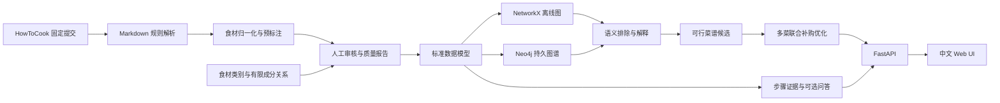

# CookKG 项目定义、故事与总体架构

> 当前课题：基于食材层级知识图谱与约束优化的可解释家庭菜单规划系统

## 1. 一句话定义

CookKG 面向需要决定一餐吃什么的学生和家庭用户。用户输入已有食材、常备调料、排除的具体食材或食材类别、菜数及最多补购种类，系统利用食材层级知识图谱识别直接和间接的忌口冲突，从经过审核的 HowToCook 菜谱中选择一组满足硬约束且联合补购种类较少的菜，并给出可以追溯到原文的解释。

项目的核心不是普通的“输入食材搜索菜谱”，而是：

> **在库存、采购上限和层级化忌口约束同时存在的情况下，如何生成满足硬约束、联合补购种类较少且能够解释原因的多道菜菜单？**

## 2. 项目故事

### 2.1 用户与情境

用户下课或下班回家，冰箱里有鸡蛋、番茄和土豆，家中已有盐、食用油和生抽，希望做两道菜，最多再买两种食材，并且不吃辣椒。

普通菜谱搜索通常一次返回一道菜。用户仍需自己完成以下工作：

- 比较每道菜缺少什么；
- 合并多个购物清单并去重；
- 判断“小米椒”等具体食材是否属于排除的“辣椒”类别；
- 区分必需食材和可以省略的可选食材；
- 检查推荐结果是否真实来自原菜谱。

纯文本检索或大模型回答也可能遗漏必要食材、只做字面忌口匹配、把可选项视为必需项，或者给出没有来源支持的做法。

CookKG 将过程拆成两个确定性阶段：

1. **语义过滤：**沿食材别名、类别和成分关系扩展排除条件；必需食材冲突时淘汰菜谱，可选食材冲突时保留菜谱并省略该项。
2. **组合优化：**计算整组菜单的必需食材并集，减去库存和常备调料，在补购上限内选择补购种类较少、库存利用较高的组合。

### 2.2 核心演示

目标输入：

```text
已有食材：鸡蛋、土豆、西红柿
常备调料：盐、食用油、生抽
排除食材或类别：辣椒
菜数：2
最多补购：2 种
```

系统应输出：

- 推荐的两道菜；
- 两道菜合并去重后的补购清单；
- 已利用的库存食材；
- 被省略的可选项；
- 未进入候选池的代表性菜谱及图谱解释路径；
- 固定到 HowToCook 数据提交的原文链接。

解释示例：

```text
小炒肉 -> 必需使用 -> 小米椒 -> 属于 -> 辣椒
用户排除“辣椒”，因此小炒肉被淘汰。
```

如果辣椒只是一道菜的可选食材，系统保留该菜并说明制作时省略该项。

当前 v0.1 已能演示精确排除和联合补购。食材类别推理、选择组和 Web UI 属于下一阶段目标，不能在答辩中描述为已经完成。

### 2.3 项目价值

- **对用户：**减少比较菜谱、检查忌口和手工合并购物清单的工作。
- **对课程：**覆盖实体与关系抽取、本体设计、知识图谱构建、多跳查询、约束计算和可解释应用。
- **对实验：**可以分别测量语义忌口推理和联合补购优化的增益，而不是只展示图谱页面。

## 3. 研究问题与创新点

### 3.1 研究问题

项目围绕三个可以实验验证的问题展开：

1. 与关键词精确匹配相比，食材别名和层级图谱能否提高忌口冲突的识别召回率，同时控制误排除？
2. 与逐道选择缺料最少的贪心方法相比，多道菜联合优化能否减少最终补购的食材种类？
3. 区分必需、可选和选择组后，能否减少菜谱误淘汰和不必要补购？

### 3.2 可主张的创新

本项目的创新属于课程项目和系统设计层面，不主张学术首创：

1. **层级化忌口推理。** 用户排除上位食材类别时，系统沿审核后的图谱关系识别具体下位食材，并输出推理路径。
2. **多菜联合补购优化。** 推荐目标作用于整组菜单，共享缺料只计算一次。
3. **按关系语义处理冲突。** 必需食材冲突会淘汰菜谱，可选食材冲突只省略该项，选择组按组约束判断。
4. **带审核门禁的知识图谱。** 自动解析只产生预标注；只有内容哈希匹配、关系无待核验项的菜谱进入严格推荐。
5. **来源可追溯。** 菜谱、关系和解释都保存固定数据版本的文件、行号和原文证据。

### 3.3 不能主张的结论

- 系统不提供医学意义上的过敏安全保证；
- 未经实验不能声称提高营养、健康水平或真实用户满意度；
- 当前按食材种类计算，不判断库存克数是否足够；
- 没有来源支持时不能自动认定两种食材可以替代；
- GraphRAG 和 LLM 问答是可选扩展，不是当前核心功能。

## 4. 用户场景与成功标准

| 场景 | 示例 | 系统行为 | 成功标准 |
| --- | --- | --- | --- |
| 库存菜单 | “有鸡蛋和土豆，做两道菜” | 返回菜单组合与合并补购清单 | 必需食材均在库存、常备或补购中 |
| 具体食材排除 | “不吃小米椒” | 淘汰必需使用小米椒的菜 | 硬约束违反率为 0 |
| 类别排除 | “不吃辣椒” | 沿层级识别小米椒、朝天椒等 | 推理结果与人工标注一致 |
| 可选项处理 | “不吃香菜” | 保留只可选使用香菜的菜并省略 | 不因可选项错误淘汰菜谱 |
| 采购限制 | “最多买两种” | 只返回补购种类不超过 2 的组合 | 输出可以通过集合运算复算 |
| 无解说明 | 条件过严 | 明确报告无可行组合及原因 | 不自动放宽条件 |
| 图谱解释 | “为什么没有小炒肉？” | 展示菜谱到排除类别的关系路径 | 每条解释有图关系和原文证据 |

课程目标为不少于 100 道人工审核菜谱和不少于 100 条评测输入。菜单硬约束违反率应为 0；语义忌口推理应相对关键词匹配提高召回率；联合优化应相对逐道贪心减少平均补购种类。

## 5. 当前状态与版本目标

### 5.1 已完成：v0.1 离线闭环

- 固定 HowToCook 提交下载及来源清单校验；
- 370 个 Markdown 全量扫描，输出 369 道标准菜谱和质量报告；
- 菜谱、食材及必需/可选/待审核关系的 NetworkX 图谱；
- 10 道菜的内容哈希绑定人工审核；
- 1 至 3 道菜的联合补购优化；
- 已有食材、常备调料、精确排除项和最多补购种类约束；
- 中文文本与 JSON CLI；
- Neo4j 快照隔离导入及节点、边、属性一致性验证；
- 29 个离线测试通过；在线 Neo4j 测试因本机未配置数据库而跳过。

### 5.2 下一阶段：v0.2 图谱语义与 Web 演示

- 将人工审核菜谱扩展到不少于 100 道；
- 将需求语义和审核状态拆分为独立字段；
- 支持必需、可选、选择组和开放选择组；
- 建立与审核菜谱相关的食材类别层级；
- 实现类别排除、多跳解释和经审核的有限成分关系；
- 提供 FastAPI 接口；
- 完成中文 Web UI、菜单结果页和局部图谱解释；
- 完成端到端联调和真实 Neo4j 验证。

### 5.3 课程最终版：v1.0 实验与交付

- 建立人工评测集和基线方法；
- 完成忌口推理、联合补购及关系语义三组对照实验；
- 保存可复现的原始实验结果和汇总指标；
- 完成课程报告、答辩 PPT 和稳定演示流程；
- 根据时间决定是否增加带引用的菜谱步骤问答。该扩展不能影响确定性菜单功能。

## 6. 总体架构



### 6.1 数据层

`Recipe` 以 HowToCook 相对路径作为稳定 ID。`Ingredient` 以审核后的标准名称作为稳定 ID。目标图谱包含以下核心结构：

```text
(Recipe)-[:REQUIRES {quantity_raw, evidence, review_state}]->(Ingredient)
(Recipe)-[:OPTIONALLY_USES {quantity_raw, evidence, review_state}]->(Ingredient)
(Recipe)-[:ONE_OF {group_id, min_select, max_select, evidence}]->(Ingredient)
(Ingredient)-[:IS_A {evidence, review_state}]->(IngredientCategory)
(IngredientCategory)-[:SUBCLASS_OF]->(IngredientCategory)
(Ingredient)-[:HAS_COMPONENT {evidence, review_state}]->(Ingredient)
(Recipe)-[:REQUIRES_TOOL]->(Tool)
```

正式模型将两个维度分开：

- `requirement` 表示 `required`、`optional`、`one_of` 或 `unknown`；
- `review_state` 表示 `auto`、`confirmed`、`pending` 或 `rejected`。

当前 v0.1 的 `required/optional/pending` 单字段模型是过渡结构，v0.2 迁移时必须保持旧数据可读取。

盐、油和糖仍是可采购食材，系统不默认用户拥有。水可以作为 `household_resource` 保留做法证据，但不进入补购清单。工具独立建模，不得混入食材。

完整标注规则见[问题定义与知识图谱初步标注规范](problem-and-annotation-standard.md)。

### 6.2 数据处理层

- `fetch`：下载并验证固定 HowToCook 提交；
- `parser`：跨原料、计算、操作和附加内容生成预标注；
- `normalize`：应用保守的食材标准名和别名规则；
- `review`：记录人工裁决、证据位置和内容哈希；
- `pipeline`：输出标准数据、质量报告和图谱文件；
- `neo4j_store`：幂等导入和验证指定数据快照。

上游文件变化时，内容哈希不再匹配，旧审核自动失效。

### 6.3 领域服务层

- `exclusion`：归一化用户排除条件，沿类别层级和审核后的有限成分关系扩展排除集合；
- `filter`：按必需、可选和选择组语义处理冲突；
- `recommend`：执行候选筛选、组合枚举、补购集合计算和稳定排序；
- `explain`：输出菜谱保留或淘汰的图路径与原文证据；
- `evaluation`：运行关键词、图谱、贪心和联合优化基线实验。

硬约束判断不依赖 LLM。未来即使增加自然语言问答，大模型也只能解释已有证据，不能决定菜单是否满足约束。

### 6.4 应用层

当前 Typer CLI 是数据处理和离线推荐入口。v0.2 增加 FastAPI，暴露：

- 健康检查；
- 菜单推荐；
- 菜谱详情；
- 排除条件解释；
- 局部图谱；
- 数据审核队列。

中文 Web UI 只调用 API，不复制推荐规则。页面包含条件输入、菜单结果、补购清单、约束解释和菜谱详情。

## 7. 核心算法

### 7.1 输入归一化

已有食材、常备调料和排除条件使用同一套标准名规则。例如“番茄”映射到“西红柿”，“马铃薯”映射到“土豆”。具体油类、酱料和辣椒品种不随意合并。

### 7.2 排除集合扩展

对用户排除的具体食材或类别执行受控图遍历：

1. 归一化名称；
2. 查找该类别的所有审核后代；
3. 可选地查找经审核且来源明确的复合食材成分；
4. 返回扩展结果和完整推理路径。

项目不根据“辣味”等模糊口味自动推断具体食材。首版只处理用户明确输入的食材名称或食材类别。

### 7.3 菜谱过滤

- 必需食材命中排除集合：淘汰菜谱；
- 可选食材命中排除集合：保留菜谱并省略该项；
- 必需选择组所有可用成员均被排除：淘汰菜谱；
- 未审核或存在 `pending/unknown` 关系：不进入严格推荐。

### 7.4 联合补购优化

设用户已有食材为 `H`，常备调料为 `P`，菜单为 `M`：

```text
Buy(M) = Required(M) - H - P
```

单菜候选按补购种类升序、库存覆盖数降序、稳定 ID 排序，截取前 60 道后枚举组合。组合按照以下键排序：

1. 补购种类最少；
2. 覆盖已有非调料食材最多；
3. 菜谱 ID 字典序。

系统只承诺候选池内最优。无解时返回明确原因，不修改用户条件。

## 8. 关键接口

### 8.1 菜单推荐请求

```json
{
  "have": ["鸡蛋", "土豆"],
  "pantry": ["盐", "食用油"],
  "exclude": ["辣椒"],
  "count": 2,
  "max_buy": 2,
  "limit": 5
}
```

### 8.2 菜单推荐响应

```json
{
  "plans": [],
  "reason": null,
  "candidate_count": 0,
  "normalized_input": {
    "have": ["鸡蛋", "土豆"],
    "pantry": ["盐", "食用油"],
    "exclude": ["辣椒"]
  },
  "excluded_ingredients": ["辣椒", "小米椒", "朝天椒"],
  "explanations": []
}
```

每个方案包含菜谱 ID、名称、固定来源链接、补购清单、已覆盖食材和被省略的可选项。每条排除解释至少包含起点、关系路径、命中的菜谱关系和对应证据。

## 9. 实验设计

### 9.1 忌口推理实验

比较以下方法：

1. 关键词精确匹配；
2. 别名归一化；
3. 食材层级图谱推理；
4. 层级图谱加经审核的有限成分关系。

指标为准确率、召回率、F1、误排除率和最终菜单约束违反率。

### 9.2 联合补购实验

比较随机选菜、逐道贪心选菜和多道菜联合优化。指标为平均补购种类数、库存食材覆盖数、可行菜单比例和推荐耗时。

### 9.3 关系语义实验

比较“所有出现食材均视为必需”和“区分必需、可选、选择组”两种方法。统计菜谱误淘汰数、不必要补购物品数和可用候选数量。

实验数据必须保存随机种子、数据提交、审核版本、输入问题和原始输出，确保结果可重复生成。

## 10. 失败处理与可信性

- 数据目录没有 CookKG 来源标记时拒绝覆盖；
- HowToCook 提交不匹配时拒绝构建；
- 上游内容哈希变化时审核自动失效；
- 有待审核或未知关系的菜谱不进入严格推荐；
- 不支持的开放选择组不会被强行展开；
- 图谱查询只使用受控模板和参数；
- 无可行菜单时不自动放宽条件；
- Neo4j 配置缺失或快照不一致时命令返回非零状态；
- 日志不得记录 Neo4j 密码、API Key 或其他密钥；
- 证据不足时明确说明，不能补写不存在的关系。

## 11. 三人分工

| 成员 | 角色 | 主要责任 | 可验收产物 |
| --- | --- | --- | --- |
| 组长（你） | 总体协调、UI 与集成 | 范围与架构、中文页面、图谱展示、联调、实验统筹、报告答辩 | UI、集成版本、项目文档和答辩材料 |
| `Zouyilin06` | 数据与知识图谱 | 解析审核、食材归一化、类别层级、本体、NetworkX/Neo4j 和数据质量 | 100 道审核菜谱、标准数据、食材层级和图谱 |
| `98K12WQ` | 算法与后端 | 忌口推理、候选过滤、联合补购、FastAPI、算法测试和评测脚本 | 推理与推荐模块、API、测试和实验结果 |

UI 不复制推荐逻辑；算法模块不直接解析 Markdown；数据模块不决定菜单排序。公共数据模型和 API 变更由三人共同确认。详细责任、阶段任务和 Git 约定见[小组成员分工](team-roles.md)。

## 12. 完成定义

项目达到课程最终版，必须同时满足：

- 新环境可以按 README 从固定 HowToCook 版本完成构建；
- 不少于 100 道菜的审核哈希有效，严格数据中没有待审核关系；
- 食材标准名、类别层级和关系证据可以追溯；
- 具体食材和上位类别排除均通过人工评测；
- 必需冲突、可选省略和选择组行为符合规范；
- Web 页面可以完成输入、推荐、补购和解释的核心演示；
- 每个返回菜单都满足用户硬约束；
- 忌口推理与联合补购对照实验可以重复生成；
- 自动测试、静态检查和 Neo4j 在线集成测试通过；
- 文档明确当前限制，不把计划功能描述为已实现功能；
- 三名成员都能解释自己的模块、接口、实验结果及其在整体系统中的作用。
