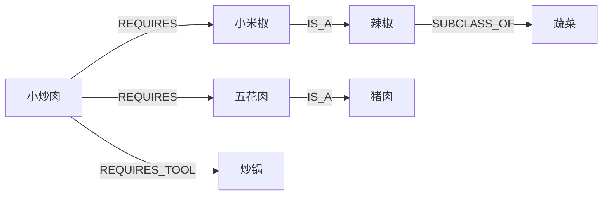

# CookKG 问题定义与知识图谱初步标注规范

> 文档状态：小组讨论稿 v0.1
>
> 数据来源：[Anduin2017/HowToCook](https://github.com/Anduin2017/HowToCook)
>
> 固定数据版本：`2b19c9e9ee926fd925a68207a57582a338813f9c`

## 1. 课题名称

> **基于食材层级知识图谱与约束优化的可解释家庭菜单规划系统**

项目简称为 **CookKG**。

## 2. 要解决的问题

### 2.1 用户问题

家庭做饭时，用户通常已经拥有一部分食材，并且存在忌口和采购数量限制。普通菜谱搜索一次返回一道菜，用户仍然需要手工判断每道菜缺少什么、合并多道菜的购物清单、检查具体食材及其类别是否违反忌口，并区分必需食材和可以省略的食材。

本项目把这一过程建模为带有语义约束的组合优化问题。

### 2.2 正式定义

用户输入：

- 已有食材集合 `H`；
- 用户明确声明的常备调料集合 `P`；
- 排除的具体食材或食材类别集合 `E`；
- 计划制作的菜数 `k`，首版限制为 1 至 3 道；
- 最多允许补购的食材种类数 `B`。

系统先利用知识图谱扩展排除集合，过滤存在必需食材冲突的菜谱，再从剩余候选菜谱中选择 `k` 道菜。设菜单组合为 `M`，菜谱 `r` 的必需食材集合为 `Required(r)`，则补购集合为：

```text
Buy(M) = (并集 Required(r), r 属于 M) - H - P
```

系统首先最小化 `|Buy(M)|`，其次最大化已有非调料食材的利用数量，并使用稳定菜谱 ID 保证结果可复现。只有满足 `|Buy(M)| <= B` 且不违反排除约束的组合可以返回。

### 2.3 忌口约束的图谱推理

排除条件不能只做字符串匹配。例如用户排除“辣椒”时，图谱应沿食材层级识别“小米椒、朝天椒、青椒”等下位食材。

```text
小炒肉 --必需使用--> 小米椒 --属于--> 辣椒
用户排除 --------------------------------> 辣椒
结论：小炒肉被淘汰
```

如果命中的是可选食材，则保留菜谱并明确省略该食材：

```text
某菜谱 --可选使用--> 小米椒 --属于--> 辣椒
结论：保留菜谱，制作时省略小米椒
```

本项目将该能力称为“忌口或排除食材约束”，不宣称提供医学意义上的过敏安全保证。

### 2.4 系统输出

每个推荐方案至少包含：

- 菜谱名称和稳定 ID；
- 固定到数据提交版本的原文链接；
- 已利用的库存食材；
- 多道菜合并去重后的补购清单；
- 因忌口而省略的可选食材；
- 菜谱保留或淘汰的解释路径；
- 无可行组合时的明确原因。

系统不得自动放宽用户条件，也不得用大模型编造缺失的食材关系。

## 3. 为什么需要知识图谱

知识图谱在本项目中用于完成三类计算：

1. **食材名称统一：**“番茄”和“西红柿”匹配到同一库存实体；
2. **食材层级推理：**排除“辣椒”时识别“小米椒”等具体食材；
3. **关系语义区分：**同一食材可能是必需、可选或选择组成员，处理结果不同。

多道菜联合补购利用菜谱与食材的图关系计算必需食材并集。两部分共同形成“语义过滤 + 组合优化”的闭环。

## 4. 项目范围

### 4.1 首版范围

- 固定 HowToCook 数据版本，扫描全部非模板菜谱；
- 人工审核不少于 100 道代表性菜谱；
- 建立审核菜谱涉及的食材标准名和食材层级；
- 支持具体食材和食材类别排除；
- 支持 1 至 3 道菜的联合推荐；
- 区分必需、可选和选择组；
- 输出补购清单、约束解释和原文证据；
- 使用 NetworkX 完成离线闭环，并支持 Neo4j 持久化。

### 4.2 暂不处理

- 精确到克数的库存扣减；
- 实时价格和采购金额；
- 营养或医学建议；
- 自动推断食材替代关系；
- 未经审核的复合食品成分；
- 用户账户、配送和烹饪时间调度。

## 5. 图谱模式

### 5.1 核心实体

| 实体 | 作用 | 稳定标识 |
| --- | --- | --- |
| `Recipe` 菜谱 | 推荐和解释的基本对象 | HowToCook 相对路径 |
| `Ingredient` 食材 | 库存、补购和排除判断对象 | 审核后的标准名称 |
| `IngredientCategory` 食材类别 | 支持上位类别排除和多跳推理 | 审核后的类别名称 |
| `Tool` 工具 | 记录菜谱所需设备，不参与补购 | 审核后的工具名称 |

### 5.2 核心关系

| 关系 | 起点 -> 终点 | 含义 |
| --- | --- | --- |
| `REQUIRES` | Recipe -> Ingredient | 菜谱必需使用该食材 |
| `OPTIONALLY_USES` | Recipe -> Ingredient | 食材可以省略 |
| `ONE_OF` | Recipe -> Ingredient | 食材属于一个选择组 |
| `IS_A` | Ingredient -> IngredientCategory | 具体食材属于某类别 |
| `SUBCLASS_OF` | IngredientCategory -> IngredientCategory | 食材类别的上下位关系 |
| `HAS_COMPONENT` | Ingredient -> Ingredient | 经过审核的复合食材成分关系 |
| `REQUIRES_TOOL` | Recipe -> Tool | 菜谱需要使用某工具 |

别名优先保存为 `Ingredient.aliases` 属性并在入库前统一，避免图中出现重复食材节点。只有需要展示名称映射过程时，才单独建立别名节点。

### 5.3 示例



## 6. 总体标注原则

实体标注以是否影响菜单可行性、忌口判断和补购集合为标准。不能简单把“必备原料和工具”章节中的每一行都当成食材。

HowToCook 的“必备原料和工具”“计算”“操作”“附加内容”之间存在遗漏和冲突。标注人员必须同时阅读四个部分并交叉核对。自动解析只生成预标注，不能直接视为人工确认结果。

## 7. 实体标注标准

### 7.1 菜谱实体

每个菜谱 Markdown 文件对应一个 `Recipe` 实体。

| 字段 | 规范 |
| --- | --- |
| `recipe_id` | HowToCook 仓库相对路径，不使用标题作为 ID |
| `name` | 一级标题去掉“的做法” |
| `category` | 来源目录，如 `meat_dish`、`soup` |
| `difficulty` | 星级数量，无法确定时为空 |
| `source_url` | 固定到指定提交的链接 |
| `source_hash` | Markdown 内容的 SHA-256 |
| `review_state` | `pending`、`confirmed` 或 `rejected` |

分类和难度首版作为菜谱属性，不单独建立节点。

### 7.2 食材实体边界

食材实体采用“采购决策粒度”：用户检查库存或购物时，可以独立回答“有或没有”的最小物品单位。

正确示例：鸡蛋、西红柿、五花肉、生抽、菜籽油。

错误示例：

- `鸡蛋 2 个`：数量不能进入实体名称；
- `葱、姜、蒜`：必须拆成三个食材实体；
- `蔬菜（比如土豆片/豆芽/花菜）`：这是选择组；
- `灯影牛肉丝/午餐肉/腊肠`：这是备选组；
- `量杯`：这是工具；
- `蒜末`：标准食材是“蒜”，“末”是加工形态。

食材字段建议为：

| 字段 | 说明 |
| --- | --- |
| `ingredient_id` | 审核后的标准名称 |
| `canonical_name` | 统一后的中文名称 |
| `mention` | 菜谱中的原始写法 |
| `aliases` | 已确认的同义名称 |
| `form` | 切片、切丝、蒜末、冷冻等形态 |
| `procurement_type` | `purchasable` 或 `household_resource` |

盐、油、糖仍然是可采购食材，不能因为常见就默认用户拥有。是否为常备调料由用户输入决定。水、清水和热水统一为“水”，可标记为 `household_resource`，保留在做法信息中但不进入补购清单。

### 7.3 工具实体

锅、碗、菜刀、量杯、厨房秤、烤箱、空气炸锅和微波炉等标为 `Tool`。工具可以有必需和可选状态，但不参与库存食材、忌口和补购计算。

## 8. 关系标注标准

### 8.1 需求语义与审核状态分离

正式标注中应分开保存需求语义和审核状态，不把 `pending` 当成一种使用方式。

`requirement` 取值：

| 值 | 含义 | 是否进入必需补购 |
| --- | --- | --- |
| `required` | 完成原文做法必须使用 | 是 |
| `optional` | 原文明示可以省略 | 否 |
| `one_of` | 一组选项中选择若干项 | 根据选择结果计算 |
| `unknown` | 原文冲突或无法判断 | 不进入严格推荐 |

`review_state` 取值：

| 值 | 含义 |
| --- | --- |
| `auto` | 程序预标注，尚未人工确认 |
| `confirmed` | 人工确认 |
| `pending` | 存在冲突，等待复核 |
| `rejected` | 确认为错误识别 |

每条菜谱-食材关系还应保存原始用量、结构化数量、加工形态、选择组 ID、原文证据、标注人员和审核时间。

### 8.2 必需食材

满足以下条件时可以标为 `required`：

- 原料章节列出，并在计算或操作中实际使用；
- 原料章节遗漏，但计算和操作明确要求使用；
- 原料用量可以按口味调整，但原料本身仍需使用。

“根据个人口味加减”表示数量可调整，不表示食材可省略。

### 8.3 可选食材

出现“可选、选用、备选、可加可不加、根据需要、味道更佳、也可加入”等明确表达时标为 `optional`。原料章节标题中的“必备”不能覆盖计算或操作中的明确可选说明。

### 8.4 选择组

出现“甲/乙”“甲或乙”“任选一种”等表达时，不能把每个成员都标成独立必需食材。选择组至少记录：

```json
{
  "group_id": "recipe-id:group-name",
  "group_requirement": "required_one_of",
  "min_select": 1,
  "max_select": 1,
  "open_group": false,
  "members": ["甲", "乙"]
}
```

如果原文使用“比如、等等、可自由搭配”，说明列举不完整，应设置 `open_group=true`。推荐算法尚未支持开放选择组时，相应菜谱不能进入严格推荐。

### 8.5 复合名称与加工形态

并列食材必须拆分。“葱、姜、蒜共 15 克”拆成葱、姜、蒜三条关系，但数量属于组合总量，不能给每个食材分别标 15 克。

| 原文 | 标准食材 | 形态 |
| --- | --- | --- |
| 大蒜、蒜瓣 | 蒜 | 原粒 |
| 蒜末 | 蒜 | 末 |
| 姜片 | 姜 | 片 |
| 葱花 | 葱 | 切花 |
| 土豆片 | 土豆 | 片 |
| 鸡蛋液 | 鸡蛋 | 打散 |

如果加工状态会影响采购或立即制作的可行性，应谨慎保留差异。例如“冷饭”不直接合并为“大米”。

## 9. 食材归一化标准

归一化采用保守原则：只有确认属于同一种采购物品时才合并。

建议合并：

```text
番茄、蕃茄 -> 西红柿
马铃薯 -> 土豆
大蒜、蒜瓣、蒜末 -> 蒜
油（未指定种类）-> 食用油
```

不得随意合并：

```text
食用油 != 菜籽油 != 香油 != 藤椒油
豆瓣酱 != 红油豆瓣酱
生抽 != 老抽
朝天椒 != 小米椒
黄油 != 食用油
牛奶 != 淡奶油
葱 != 香葱 != 大葱
```

用户输入、库存数据、排除条件和菜谱实体必须使用同一套归一化规则。项目暂不自动推断替代关系。

## 10. 数量标注标准

首版推荐按食材种类判断，数量不参与可行性计算，但必须保留以支持展示和后续扩展。

| 原文形式 | 标注方式 |
| --- | --- |
| `500g` | 保存数值和单位 |
| `1-2g` | 保存最小值和最大值 |
| `适量、少许` | 结构化数值为空，保留原文 |
| `根据口味加减 ±5g` | 保存基础值和调整范围 |
| `份数 * 12ml` | 保存为公式，不强行计算 |
| `葱姜蒜共 15g` | 标为组合总量 |

不自动把勺、滴、颗、根等单位换算成克。

## 11. 跨章节判定流程

人工标注必须按照以下顺序检查：

1. 阅读“必备原料和工具”，生成候选食材和工具；
2. 阅读“计算”，补充用量并发现遗漏；
3. 阅读“操作”，确认实际使用情况；
4. 阅读“附加内容”，识别可选添加、替代建议和说明；
5. 拆分并列项和选择组；
6. 执行名称归一化；
7. 为每条关系保存证据；
8. 对冲突项设置 `pending`，不得自行猜测。

判定优先级：明确的可选表达优先；操作中的实际使用决定食材是否参与做法；计算章节用于确定用量和发现遗漏；附加内容中的口味增强或装饰通常为可选；无法消解的冲突进入复核队列。

## 12. HowToCook 标注示例

### 12.1 水煮鱼

“蔬菜（比如土豆片/豆芽/花菜/生菜/……）”表示必须选择一种或多种垫底蔬菜，但列举不完整。应标为开放的必需选择组，不能把整个字符串当作食材，也不能把所有示例都标为必需。

“厨房秤（可选）”应标为可选工具。“豆豉 10g（可选）”应标为可选食材。“大蒜、蒜瓣、蒜末”统一到食材“蒜”，同时保留原文形态。

### 12.2 蛋炒饭

“黄瓜（可选）”和“胡萝卜（可选）”应标为可选食材，即使它们出现在“必备原料和工具”章节中。

“灯影牛肉丝/午餐肉/腊肠/卤肉等熟肉（备选）”应标为可选选择组。操作中的“如果家里有熟肉，准备好味道更佳”进一步证明该组可以整体省略。

### 12.3 西红柿鸡蛋汤

“味素 5 克（可选）”应标为可选。“葱、姜、蒜共 15 克”必须拆成三个食材，并把 15 克记录为组合总量。操作步骤中出现但原料列表遗漏的食用油，应在人工确认后补标为必需食材。

### 12.4 小炒肉

豆豉和豆瓣酱的“根据个人口味加减”只表示用量浮动，仍然标为必需。食用油出现在计算和操作中，即使原料列表遗漏，也应在人工确认后标为必需。

## 13. 严格推荐准入条件

一道菜只有满足以下全部条件才能进入严格推荐：

- 文件哈希与审核记录一致；
- 所有必需、可选和选择组均经过人工确认；
- 不存在 `pending` 或 `unknown` 关系；
- 不存在尚未拆分的并列食材字符串；
- 工具没有被错误标为食材；
- 开放选择组已经由系统支持或经过人工收敛；
- 每条影响推荐的关系都有原文证据；
- 标准名称通过统一词表校验。

## 14. 评测方案

### 14.1 忌口推理实验

比较关键词精确匹配、别名归一化、食材层级图谱推理，以及层级图谱加经审核的复合食材成分推理。指标包括忌口识别准确率、召回率、误排除率和最终菜单约束违反率。

### 14.2 联合补购实验

比较随机选菜、逐道选择缺料最少的菜和多道菜联合优化。指标包括平均补购种类数、已有食材覆盖数、可行菜单比例和推荐耗时。

### 14.3 关系语义实验

比较“所有食材均视为必需”和“区分必需、可选、选择组”两种方法，统计错误淘汰的菜谱数量、不必要的补购物品数量和可用菜谱数量。

## 15. 标注质量控制

先由两名标注人员独立标注同一批 20 道菜，由项目负责人裁决分歧并冻结规范 v1.0。随后分配剩余菜谱，每人完成主标任务，并交叉复核对方不少于 10% 的结果。

每次修改审核结果都应记录标注人员、审核人员、审核日期、原文内容哈希、修改原因和证据行号。上游文件内容变化后，旧审核自动失效，必须重新核验。

## 16. 当前结论

本课题最终解决的不是普通的“根据食材搜索菜谱”，而是：

> **在存在库存、采购上限和层级化忌口约束的情况下，生成满足硬约束、联合补购种类较少且能够解释原因的多道菜菜单。**

食材层级图谱负责识别直接和间接的排除冲突，菜谱-食材关系负责计算可行性和补购集合，组合优化负责从可行菜谱中选择整体方案。三者共同构成项目的核心技术闭环。
